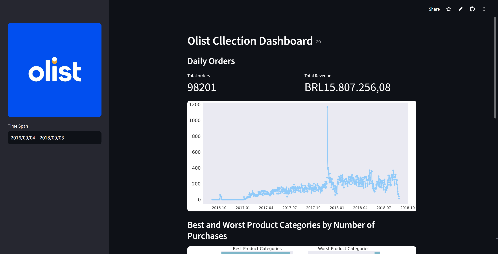

# Langkah-Langkah Menjalankan dashboard.py

## Instalasi
Untuk menjalankan dashboard di komputer lokal diperlukan langkah-langkah berikut:
1. Clone repository menggunakan perintah berikut pada terminal.
   ```
   git clone https://github.com/wildan-wicaksono/brazilian_e-commerce.git
   ```
2. Instal pustaka-pustaka untuk menyesuaikan lingkungan Python dengan menjalankan perintah berikut.
   ```
   pip install -r requirements.txt
   pip install streamlit
   ``` 
## Run Streamlit
Masuk ke direktori proyek pada komputer lokal Anda dan jalankan dashboard.py menggunakan perintah berikut.
```
cd bike-sharing/dashboard/
streamlit run dashboard.py
```
Jika berhasil, maka akan muncul tampilan seperti berikut.

